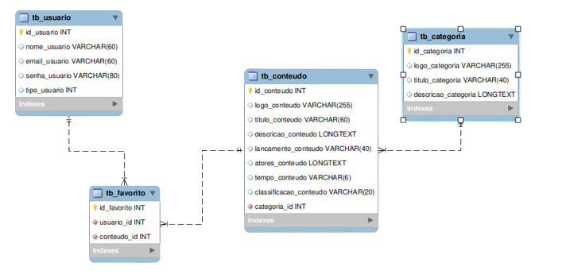
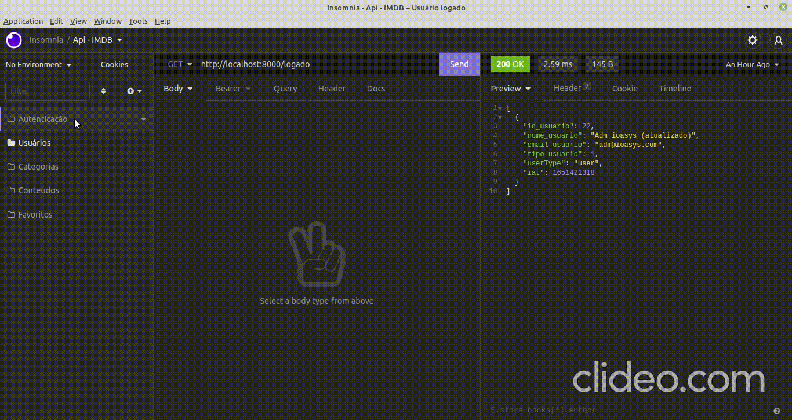

<p align="center">
   
</p>

<p align="center">
    
    
    
    
    
</p>

### Links úteis

Api: 
[Documentação da API](https://peaceful-bonbon-5eafb1.netlify.app/)

Como ter acesso ao banco de dados? 
[Estrutura do banco de dados]()

### Dotenv

```bash
# src/server.js
PORT=

# src/database/index.js
BD_NAME=
BD_USER=
BD_PASS=
PORT_CONFIG=
HOST_CONFIG=
```

Existe um arquivo chamado **.env.example**, é necessário criar o arquivo **.env**, e inserir os dados anteriores dentro dele.

Não é necessário utilizar as variáveis de ambiente, mas é necessário alterar seguindo as necessidades da sua máquina para comportar-se corretamente ao ambiente do backend.

### Sobre o projeto

O projeto consiste em um reprodução da api imdb, possuindo componentes para que os dados possam ter cadastrado, atualização e exclusão, além de suas respectivas apresentações.

### Modelagem do banco de dados



### Layout

O layout da aplicação da aplicação está disponível abaixo:

<div>
    <table>
      <thead>
        <tr>
           <th>
              
           </th>
        </tr>
      </thead>
      <tbody>
      </tbody>
    </table>
</div>

### 🚀 Como executar o projeto

Este projeto é dividido em três partes:

<ul>
   <li>Modelagem do Banco de dados</li>
   <li>Construção e desenho da estrutura back-end</li>
   <li>Desenvolvimento dos endpoints</li>
   <li>Documentação da API</li>
</ul>

#### Pré-requisitos

Antes de começar, você vai precisar ter instalado em sua máquina as seguintes ferramentas: [Git](https://git-scm.com/), [Node.js](https://nodejs.org/en/). Alem disto é bom ter um editor para trabalhar com o código como [VSCode](https://code.visualstudio.com/).

##### 🧭 Rodando a aplicação web - React

```bash

# Clone este repositório
$ git clone https://github.com/MateusMaciel340/api-imdb.git

# Acesse a pasta do projeto no terminal/cmd - React
$ cd api-imdb/

# Instale as dependências
$ npm install

# Você pode configurar isso em Scripts
$ npm run dev

```

💡 O projeto acima foi construido com Nodejs/Expessjs, ou seja, é apenas a demonstração de uma API, não existe uma interface front-end ainda.


### 🛠 Tecnologias

As seguintes ferramentas foram usadas na construção do projeto:

<b>Back-end ([Nodejs](https://nodejs.org/en/))</b>

<ul>
   <li>Nodejs</li>
   <li>Expressjs</li>
   <li>ORM (Sequelize)</li>
   <li>Banco de dados: MySQL</li>
   <li>Express JWT - Autenticação</li>
</ul>

### 👨‍ Contribuidores

<div>
    <table>
      <thead>
        <tr>
           <th>
              
           </th>
        </tr>
      </thead>
      <tbody  align="center">
           <td>
             Mateus Maciel
           </td>
      </tbody>
    </table>
</div>

### 💪 Como contribuir para o projeto

1. Faça um **fork** do projeto.
2. Crie uma nova branch com as suas alterações: `git checkout -b feature/novos-endpoints`
3. Salve as alterações e crie uma mensagem de commit contando o que você fez: `git commit -m "Adicionando o endpoint de atualizar senha"`
4. Envie as suas alterações: `git push origin feature/novos-endpoints`

### 📝 Licença

Este projeto esta sobe a licença [MIT](https://github.com/nodejs/node/blob/master/LICENSE).